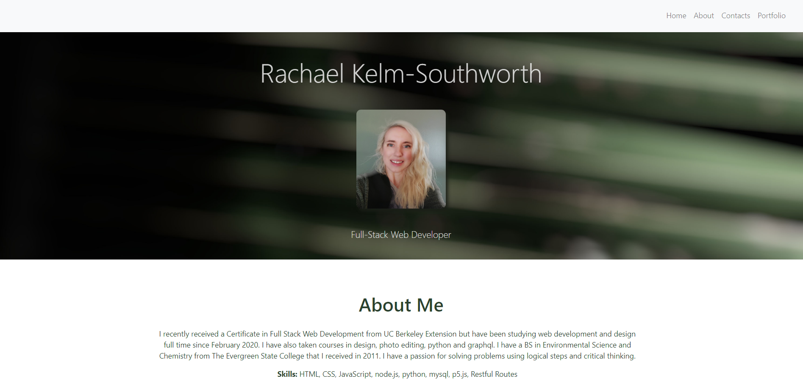

# React Portfolio

### A simple app to help you sort through your employees by name

## Table of Contents
* [Technologies Used](Technologies_Used)
* [Deployed Site](Deployed)
* [Features](Features)
* [Usage](Usage)
* [Author](Author)
* [Credits](Credits)
* [License](License)

## Technologies_Used
* HTML 
* CSS
* React.js
* github pages

## Deployed Site
[ClickClick!](https://rksouth.github.io/React-Portfolio/)

## Features 

__1. A Single Page Display__
 
Ever since I started building portfolios I always wanted the single page display. I wanted it to be one beautiful page of awesomeness because that's how the pros do it. 

First I started by calling all my pages as part of the Homepage:

However, the real trick was getting the Navigation to auto-scroll to the section once it was clicked. Many of classmates chose to do a switch route, which I admit, intrigued me. I watched many videos on how to build routes and attempted it several times, unsuccessfully.  
Then, Manuel taught me how to use id's in react. 

1. First you make sure you are linking your page correctly by doing an import Home from "..." the file path

2. Then you place an id="Home" where you want the home to link to, in my case the jumbotron.

3. Then you set the href="#Home" in side the a tag - this assures a single page scroll.

 

__2. Linked Images__

In order to display images in React.js you can't simply dump the source into your box/container/card and expect it to work, turns out. So I had to go a searching. I found a really helpful medium [article](https://medium.com/better-programming/how-to-display-images-in-react-dfe22a66d5e7) that details all the ways (with super helpful code snippets) you can link an image into a site. I followed the hook examples by importing the image first and then setting the source = {name} where I wanted it to be placed.

__3. Well Proportioned Cards__

I have struggled with getting size/proportion right on previous assignments. However, I think I was able to do a pretty good job, I used a combination of bootstrap sizing and css. Below you can see an image of my CSS:

__4. GitHub Deploy Instructions__

I also included written instructions on how to deploy a react app to github.
[deploy](GHPagesDeployInstructions.MD)

__5. Future Development__ 

* Add some database components

* Tweak the display -it's decent but it always could be better

* Include more React centric code - I used a lot of what I already know for this current version but I would like a portfolio (or a project) that doesn't rely on the methods I have used before.

## Usage
### How do you use this project? How ever you would like.
 
## Author 
Rachael Kelm-Southworth

* [linkedin](https://www.linkedin.com/in/rachael-kelm-southworth-87a3831b3) 

* [Portfolio](https://rksouth.github.io/Portfolio/ )

* [github](https://github.com/RKSouth/)

 ## Credits

I would like to thank Kerwin, Manuel, Roger, Jerome and all my classmates for helping me understand this subject matter and anyone that contributed to make the base code.

## License
[MIT](https://choosealicense.com/licenses/mit/)

